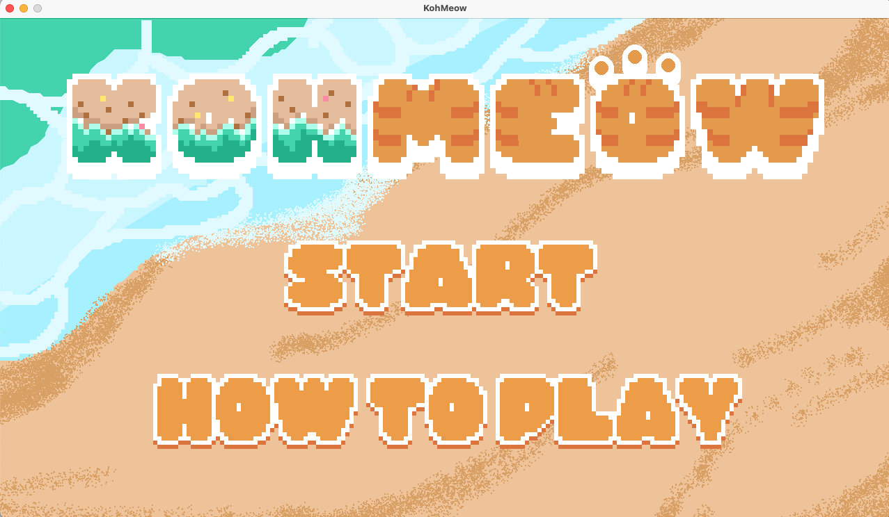
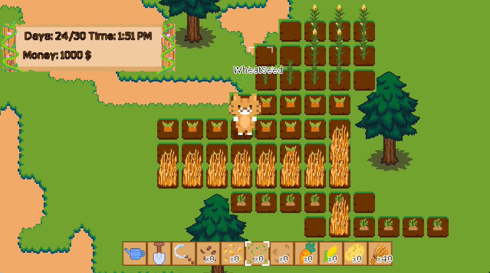

# Kohmoew Game 

## Libgdx Based  
- [@libgdx](https://github.com/libgdx)

## Drawing Tools
- [@aseprite](https://github.com/aseprite/aseprite)


## Build to .jar file

```shell
./gradlew clean
./gradlew desktop:dist  
```
----






----
## Contributors
<div style='display:flex;flex:1 1 auto;'>
<a href="https://github.com/pattanunNP/">
  
</a>
<a href="https://github.com/Wanrada-DN/">
  

</a>
</div>

[@pattanunNP](https://github.com/pattanunNP)
[@Wanrada-DN](https://github.com/Wanrada-DN)

### Artworks and Graphics
- @Wanrada-DN 

### Programming
- @pattanunNP


# Code Stage
```
-------------------------------------------------------------------------------
Java                            19            662            127           2037
XML                             10              0              0           1648
JSON                             3              6              0            132
Bourne Shell                     1             27            108             99
Gradle                           4             24              0             98
TypeScript                       4              0              0             91
YAML                             1             12              3             72
DOS Batch                        1             21              2             66
Markdown                         1             16              0             29
diff                             1              1              5             17
-------------------------------------------------------------------------------
SUM:                            45            769            245           4289
-------------------------------------------------------------------------------
```